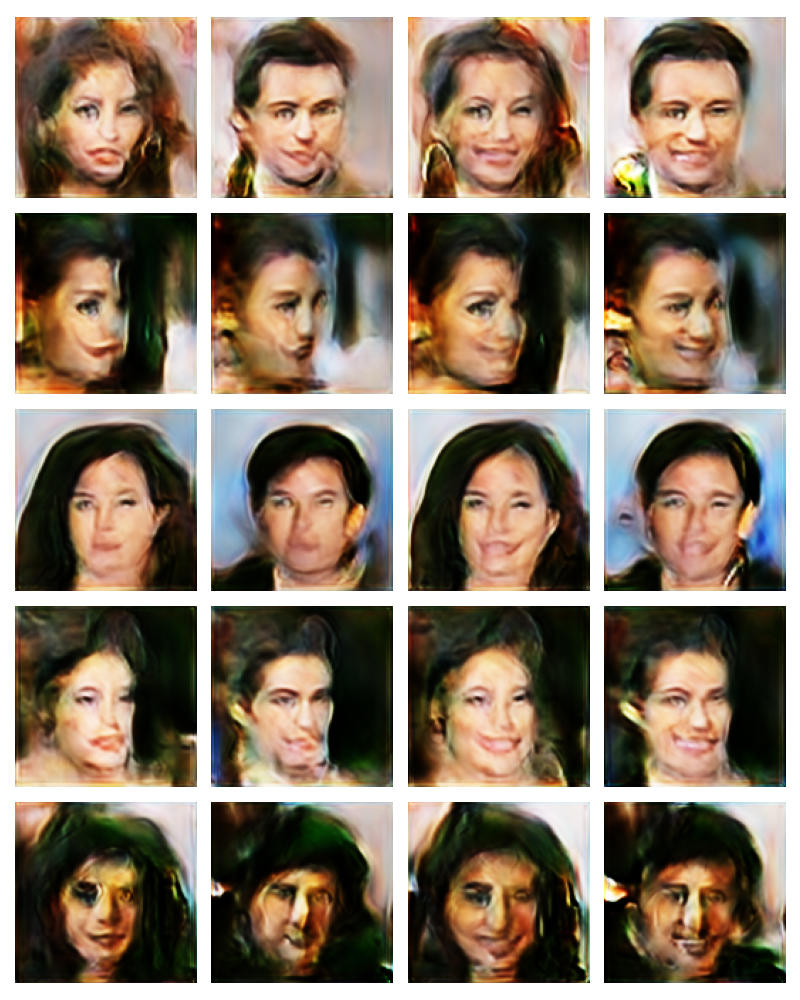
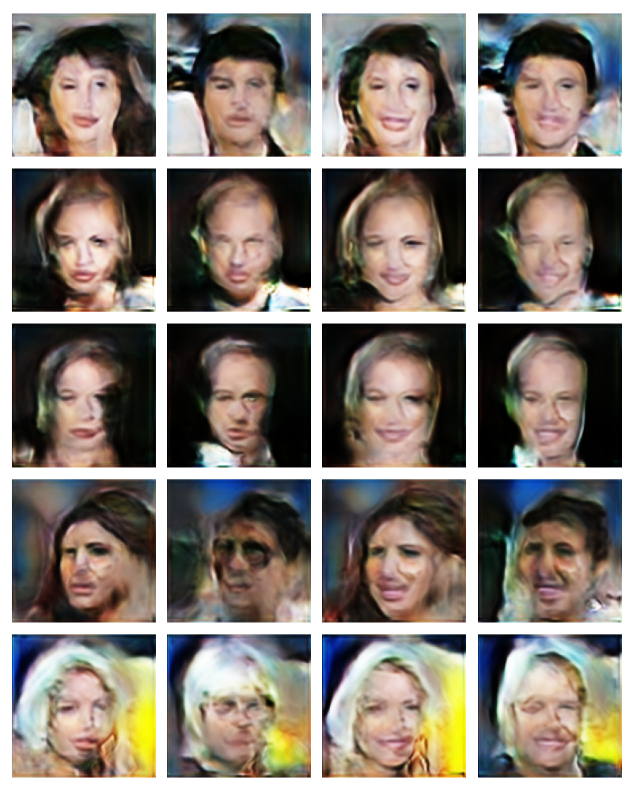
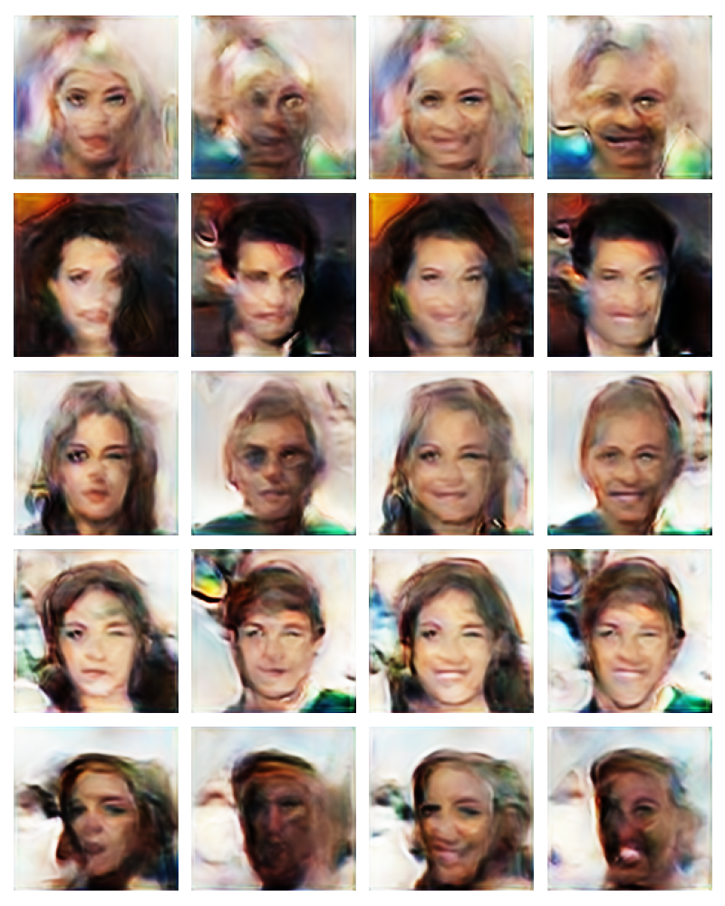
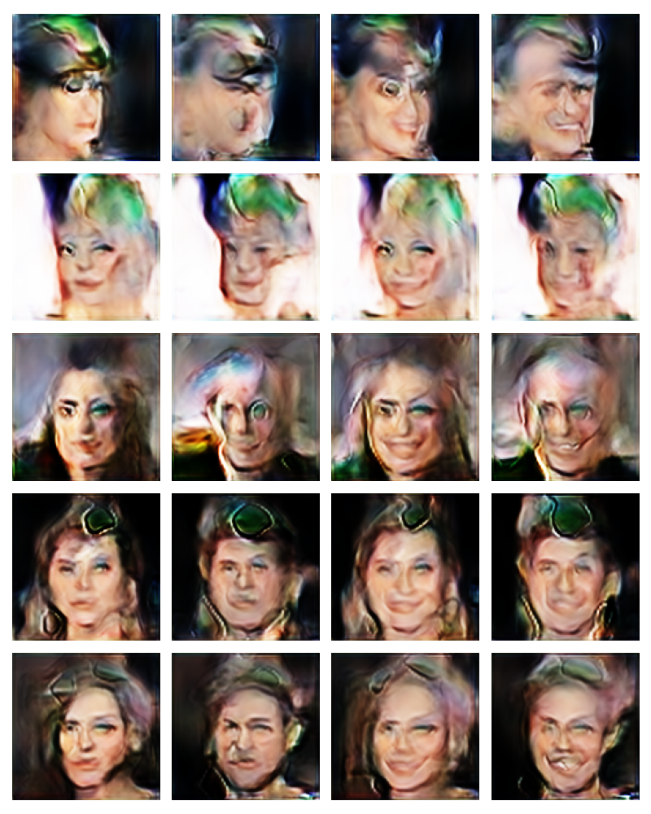

This experiment is an implementation of combining ACGAN and WGAN with gradient penalty. Generating images that look like
the people in CelebA dataset.  

After 1 day training, some of OK results:




Some of weird results:




## Run code
parse data
```shell script
python dataset.py --data_dir "D:/data/celebA_img_align"
```

train model
```shell script
# acgan with gradients penalty
python train.py --latent_dim 128 --data_dir "D:/data/celebA_img_align/" --label_dim 2 --batch_size 8 --epoch 101 --lambda 10 --d_loop 1 -lr 0.0002 --beta1 0. --beta2 0.9 --net resnet --soft_gpu --norm batch
```

```shell script
tensorborad --logdir visual
```

After some runs, I find enlarging the network size would help generating better images. But restricted by my GPU and memory,
I didn't try out all network structures.


