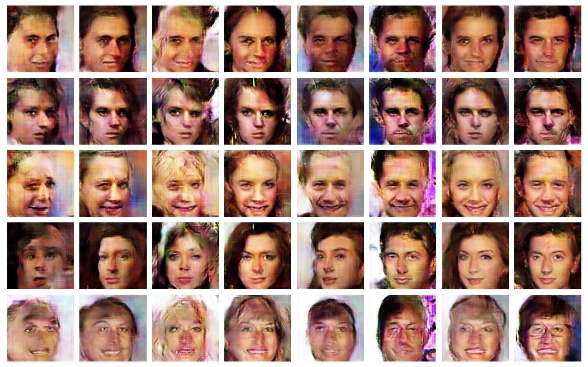
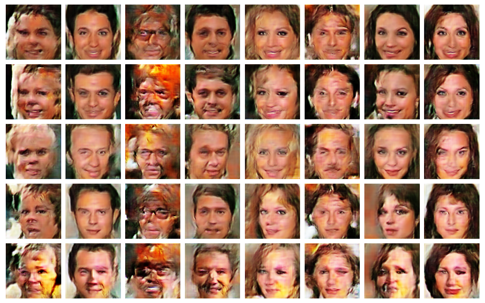
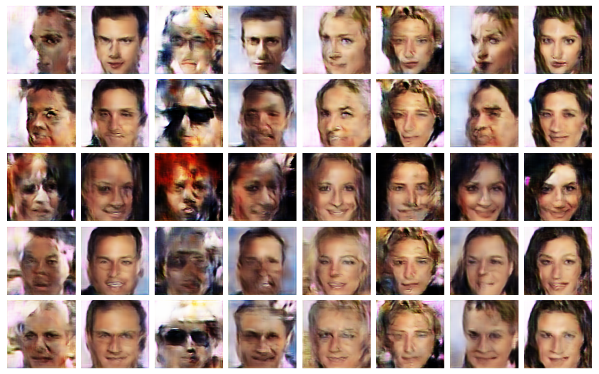

```shell script
# acgan without gradients penalty
python train.py --model acgan --latent_dim 168 --label_dim 3 --batch_size 32 --epoch 101 --soft_gpu -lr 0.0002 --beta1 0.5 --beta2 0.9 --net resnet --norm batch

# acgan with gradients penalty
python train.py --model acgangp --latent_dim 256 --label_dim 3 --batch_size 10 --epoch 101 --soft_gpu --lambda 10 --d_loop 1 -lr 0.0002 --beta1 0. --beta2 0.9 --net resnet --norm batch
```

```shell script
tensorborad --logdir visual/acgan
tensorborad --logdir visual/acgangp
```





